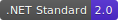

# Poetry References Library

This library includes the .NET implementation to read data from [chinese-poetry project](https://github.com/chinese-poetry/chinese-poetry).

[](https://github.com/nuscien/trivial/blob/master/LICENSE)





## Setup

You need make sure the original data folder `chinese-poetry` is in the directory that your app is in.

## SDK

```csharp
using Poetry.Chinese;
```

You can load following poetry collections.

- `await LoadPrimateSchoolAsync()` Get the Primate School 蒙学.
- `await LoadTangPoetryAsync()` Get the Tang Poetry 唐诗.
- `await LoadSongPoetryAsync()` Get the Song Poetry 宋诗.
- `await LoadSongLyricsAsync()` Get the Song Lyrics 宋词.
- `await LoadYuanVersesAsync()` Get the Yuan Verses 元曲.
- `await LoadBookOfSongsAsync()` Get the Book of Songs 诗经.
- `await LoadFourBooksFiveClassicsAsync()` Get the Four Books and the Five Classics 四书五经.
- `await LoadConfucianAnalectsAsync()` Get the Confucian Analects 论语.
- `await LoadChuSongsAsync()` Get the Chu Songs 楚辞.
- `await LoadHuajianAnthologyAsync()` Get the Huajian Anthology 花间集.
- `await LoadSouthernTangPoetryAsync()` Get the Southern Tang Poetry 南唐词.
- `await LoadCaocaoAnthologyAsync()` Get the Caocao Anthology 曹操诗集.

## CLI

You can open the `Poetry.Chinese.exe` application file directly or run following on Windows.

```sh
.\Poetry.Chinese
```

And for macOS and Linux, you can execute following command.

```sh
dotnet Poetry.Chinese.dll
```

## Build

Open `Poetry.sln` solution file and build by Visual Studio. The output libraries and files will be in `bin\Debug` or `bin\Release` directory.
